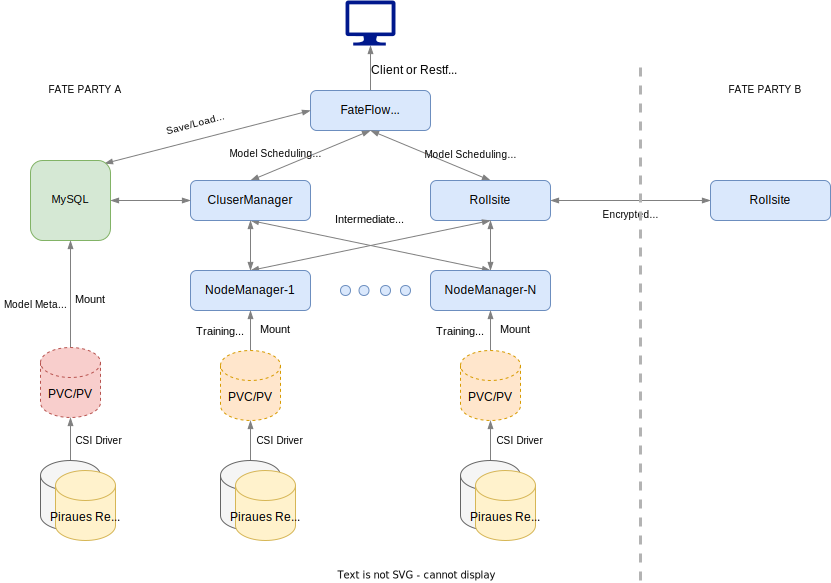

# SPDB's Federated AI System on Kubernetes

SPDB's Big Data Department runs their machine learning tasks on FATE Flow platform. [FATE Flow is a multi-party federated task security scheduling platform for federated learning end-to-end pipeline](https://github.com/FederatedAI/FATE-Flow). SPDB has containerized FATE Flow components so that it runs completely on Kubernetes.

According to their design, the NodeManager pods have to store data somewhere safe and should be able to find that data after rescheduling. SPDB, at first, uses NFS from an external enterprise NAS storage, which gets the job done but offers a horrible performance.

By adopting Piraeus, SPDB replaces NFS volumes with high-performance block volumes. Piraeus CSI and DRBD Transport make sure the pods can attach the volumes anywhere in the Kubernetes cluster. DRBD synchronous replication ensures data availability, which also enables SPDB to further containerize the OTLP components, such as MySQL.

